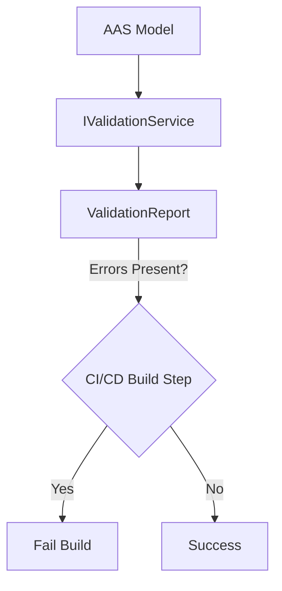
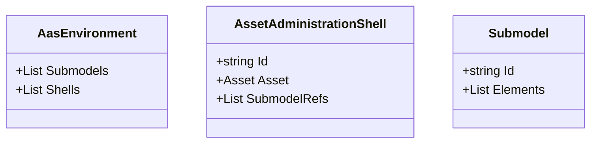
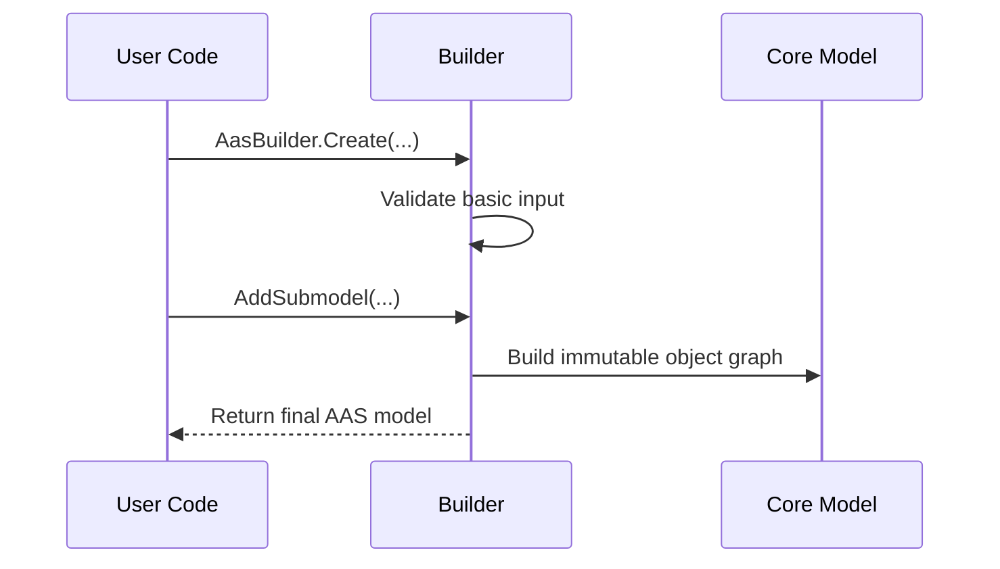
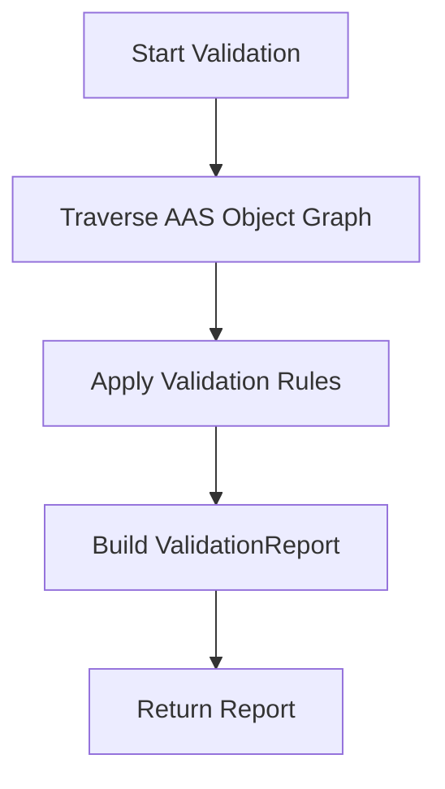
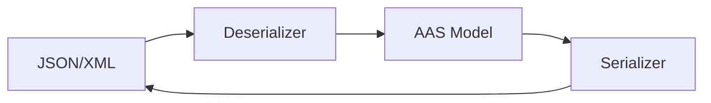

# **Fluent AAS – Architecture Documentation**

This document provides a technical architecture overview of the **Fluent AAS C# Library**, an open-source project designed to simplify the creation, reading, validation, and serialization of **Asset
Administration Shell (AAS)** models using a fluent, domain-specific C# API.

---

# 1. **Core Requirements**

The Fluent AAS library aims to deliver an intuitive, modular, and production-ready C# implementation of AAS modeling.  
The following table summarizes the core functional and technical requirements:

| Requirement                 | Description                                                         | Technical Goal                                                               |
|-----------------------------|---------------------------------------------------------------------|------------------------------------------------------------------------------|
| **Fluent Modeling**         | AAS models must be easy to build with a highly readable Fluent API. | Provide a C# DSL over the AAS meta-model.                                    |
| **Model Validation**        | Full meta-model validation must be supported.                       | Provide an independent `IValidationService`.                                 |
| **Modularity**              | Responsibilities must be separated and replaceable.                 | Multi-project structure: `Core`, `Builder`, `Validation`, `IO`.              |
| **Testability (TDD-Ready)** | Architecture must support isolated, deterministic testing.          | Immutable data models, decoupled services.                                   |
| **CI/CD Integration**       | Validation output must be machine-readable and deterministic.       | Provide `ValidationReport` with `HasErrors` and detailed `ValidationResult`. |
| **Open Source**             | Clear, dependency-light source code.                                | Industry-friendly OSS license, maintainable architecture.                    |

---

# 2. **Library Architecture Overview**

The library follows a **modular multi-assembly architecture**, where each assembly has a clearly defined responsibility.

## 2.1 Multi-Project Structure

```mermaid
flowchart LR
    A[FluentAas.Core<br/>Immutable AAS Data Models] --> B[FluentAas.Builder<br/>Fluent API]
    A --> C[FluentAas.Validation<br/>Meta-Model Validation]
    A --> D[FluentAas.IO<br/>Serialization & Parsing]
    C --> D
````

### Project Overview

| Project                  | Namespace              | Responsibility                                              | Depends On       |
|--------------------------|------------------------|-------------------------------------------------------------|------------------|
| **FluentAas.Core**       | `FluentAas.Core`       | Immutable AAS data model types (meta-model representation). | —                |
| **FluentAas.Builder**    | `FluentAas.Builder`    | Fluent API for constructing domain models.                  | Core             |
| **FluentAas.Validation** | `FluentAas.Validation` | Meta-model validation with extensible rule sets.            | Core             |
| **FluentAas.IO**         | `FluentAas.IO`         | JSON/XML serialization and deserialization utilities.       | Core, Validation |

---

# 3. **Key Mechanisms**

## 3.1 Fluent Modeling / Fluent Builder Pattern

The library exposes a fluent DSL that abstracts meta-model complexity while ensuring readability and correctness.

### Example

```csharp
var myAas = AasBuilder.Create("urn:aas:id:123")
    .WithAsset("urn:asset:id:xyz", AssetKind.Instance)
    .AddSubmodel(SubmodelBuilder.Create("urn:submodel:id:data")
        .AddProperty("Manufacturer", "ACME Corp")
        .Build())
    .Build();
```

### Benefits

* Highly readable and expressive model construction
* Inline validation prevents common mistakes
* Easily testable, snapshot-friendly structure

---

## 3.2 Model Validation Architecture

Validation is implemented as an independent module to maintain strong separation of concerns.



### Two-Phase Validation Strategy

#### **1) Inline Builder Validation**

* Immediate feedback
* Null checks
* ID format checks
* Enforcement of required fields

#### **2) Full Meta-Model Validation (in `FluentAas.Validation`)**

* ID uniqueness and reference integrity
* Structural and semantic compliance with AAS meta-model
* Validation includes detailed results:

**ValidationResult Fields:**

* `Level` (Error, Warning, Info)
* `Code`
* `Message`
* `Path` inside model tree

### CI/CD Integration

```csharp
public sealed class ValidationReport
{
    public bool HasErrors { get; }
    public IReadOnlyList<ValidationResult> Results { get; }
}
```

This structure enables machine parsing for SARIF, JUnit XML, GitHub annotations, etc.

---

# 4. **Internal Architecture Design**

## 4.1 Core Module – Immutable Data Models



### Design Principles

* Pure immutable `record` types
* No property setters
* Ideal for snapshot-based tests
* Serialization-friendly structure

---

## 4.2 Builder Module – Fluent Construction DSL

### Design Goals

* Chainable, intuitive fluent API
* Low cognitive complexity
* Safe defaults and guardrails
* Consistent domain abstraction



---

## 4.3 Validation Module – Meta-Model Consistency

### Validation Flow



### Rule System (Strategy Pattern)

Rules follow an extensible plug-in design:

* `IValidationRule` interface
* Rule categories:

    * ID Rules
    * Reference Rules
    * Submodel Rules
    * Semantic Rules

---

## 4.4 IO Module – Import & Export

### Responsibilities

* JSON/XML serialization
* JSON/XML deserialization
* Optional post-parse validation
* Streaming support for large models



---

# 5. **Testing Strategy**

The architecture is optimized for TDD:

* Immutable core models enable deterministic tests
* Fluent builders tested via snapshot testing
* Validation service covered by isolated rule test suites
* IO round-trip (serialize→deserialize→validate) tests ensure stability

